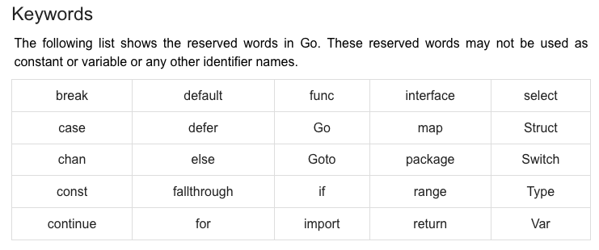

# Go Language Introductory Study

##Background
- Go is a general purpose programming language developed by Google in 2007, and released in 2009
- Programs are organized into packages for dependency management
  - this means programs are put through a compiler / linker before producing an executable
- Provides support for the following
  - Garbage Collection 
  - Concurrency
    - Via `go routines`, `channels`, and the `select` statement
  - Type inference
  - Interfaces
  - Type Embedding?
  - Statically linked binaries
- The following features are **NOT** included in the language
  - Type Inheritance
  - Method / Operator Overloading
  - Circular Dependencies within packages
  - Pointer Arithmetic
  - Assertions
  - Generic Programming

##Getting Started
###Environment Setup
- Follow the instructions under `https://go.dev/doc/ -> Installing Go`
- **[OPTIONAL]** - Install Goland IDE (Intellij) `https://www.jetbrains.com/go/`
  - Use school email to access these resources free
- Running a .go file
  - Simply find a terminal, go to the location of the file, and run `go run $FILENAME.go`

###Program Structure
- First line of program **MUST** define the package where the program is
  - Each package has a path and a name associated with it. The `main` package is the starting point of programs
- The `import` statement is a preprocessor command - similar to `#include` in C languages
- Comments
  - Single Line: `//this is a comment`
  - Multi Line: 
  ```
  /* 
    This is a comment block 
  */
   ``` 
- Capitalized Names from `import` statements
  - Function names such as `fmt.Println(...)` are capitalized to denote they are exported, meaning the importer has access
- Go programs are made of `tokens`
  - Keywords
  - Identifiers
  - Constants
  - Strings
  - Symbols
- Statements are separated by lines (not `;`)
- Identifier grammar: `identifier = letter { letter | digit }`
  - Go is case sensitive 
  - Go does not allow special characters in identifiers
  


###DataTypes
- Primitives
    - Booleans (T or F)
    - Numerics (integer or floating point)
      - byte
      - int
      - float32
    - Strings (sequence of bytes - immutable)
- Derived Types
    - Pointers
    - Arrays
    - Structures
    - Unions
    - Functions
    - Slices
    - Interfaces
    - Maps
    - Channels
    
- Defining variables
  - Two methods:
    - Static: `var variable_list type`
      - Notice you can pass in a list of variables or just one
      - Type is optional in this declaration
    - Dynamic: `variable_name := value`
      - The type will be determined dynamically
  - Using type inference, we can mix variable definitions, though this reduces readability
- Like C languages, Go supports `lvalue` and `rvalue`
  - `lvalue` - expressions referring to a memory location (a pointer to the memory location)
  - `rvalue` - refers to a data value stored at some address in memory 
    - **NOTE:** this means rvalues **CANNOT** be on the left side of a declaration

- Supports standard arithmetic, logical, and bitwise operators
### Control Structures & Functions
######Conditionals
  - if / if...else (can be nested)
  - switch (allows variable to be tested for equality)
  - select (case statements here refer to channel communications)
######Loops
  - For loop
  - Loop Control Statements
    - `break` - terminate loop / switch statement
    - `continue` - return to top of loop
    - `goto` - transfer control to labeled statement
######Functions
- General format:
  ```
  func name([parameters]) [return types] {
    body
  }
  ```
- Functions can return multiple values (use a comma to separate)
- Function args can be called by either value or reference
- Can be used in the following:
  - Values
  - Function Closure: https://www.tutorialspoint.com/go/go_function_closures.htm
  - Methods
- **IMPORTANT NOTE:** In case you haven't noticed yet, there has been no definition for classes: This is because they do not exist in Go.
##Resources
- Go website: https://go.dev/
- Geeks for Geeks: https://www.geeksforgeeks.org/go-programming-language-introduction/
- Tutorialspoint: https://www.tutorialspoint.com/go/go_overview.htm